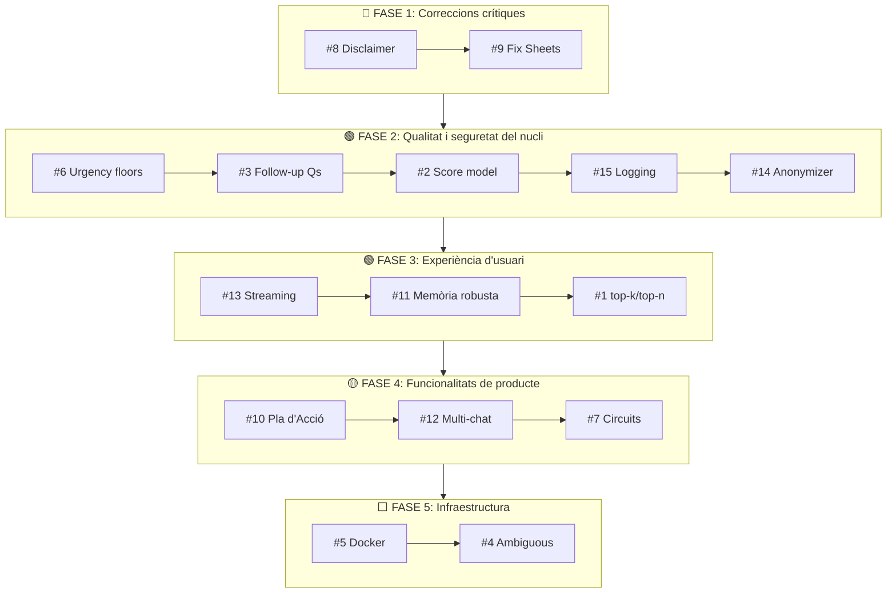

# 📋 Anàlisi Detallada de Millores — TFG RAG B-Resol

Estudi exhaustiu de les millores proposades per al sistema RAG de b-resol, analitzades des de la perspectiva d'Arquitectura de Software i Anàlisi de Producte. El document inclou:
- **Millores 1-9**: Anàlisi tècnica del sistema actual.
- **Millores 10-12**: Propostes funcionals de l'equip de producte.
- **Millores 13-15**: Propostes d'arquitectura i producció de l'expert tècnic.

---

## Millora 1: Augmentar `top-k` i `top-n` per recuperar més chunks

### 1. En què consisteix

Actualment el pipeline utilitza aquests valors a [rag_pipeline.py](file:///c:/Users/polvi/OneDrive/Escriptori/TFG/TFG_RAG_B-Resol/src/rag/rag_pipeline.py#L128-L270):

| Tipus de consulta | `top_k` (candidats Qdrant) | `top_n` (finals post-reranking) |
|---|---|---|
| `application` | 15 | 5 |
| `legal_support` | 10 | 4 |
| `mixed` | 12 (app) + 8 (legal) = 20 | 4 + 2 = 6 |

La proposta és **augmentar `top_k`** (ex. de 15 a 20-25) i/o **augmentar `top_n`** (ex. de 5 a 6-8) per donar al generador més context documental.

### 2. Com es podria dur a terme

1. Modificar els paràmetres a les crides `_retrieve_and_rerank()` dins de [rag_pipeline.py](src/rag/rag_pipeline.py#L182-L193).
2. **Augmentar `top_k` a 20-25** és segur: simplement amplia el conjunt de candidats que el CrossEncoder avalua. El reranker ja s'encarrega de filtrar el soroll.
3. **Augmentar `top_n` a 6-7** requereix ajustar el límit de `max_total_chars` al [ContextBuilder](src/rag/context_builder.py#L17-L23) (actualment `max_total_chars = 9000`), ja que cada chunk addicional consumeix ~1500-1800 caràcters extra dins del prompt.
4. Fer proves comparatives (A/B) amb consultes reals per mesurar si les respostes milloren o si el LLM comença a "diluir" la informació.

### 3. Viabilitat

> [!TIP]
> **Alta.** Canvi de configuració menor. No requereix cap redisseny arquitectònic.

- Augmentar `top_k` a 20 és completament viable: el CrossEncoder (`mmarco-mMiniLMv2-L12-H384-v1`) processa 20 parells en menys de 200ms addicionals.
- Augmentar `top_n` requereix atenció al límit de tokens del context window de Gemini 1.5 Flash (1M tokens, no és problema) i al `max_total_chars` del ContextBuilder.

### 4. Impacte

| Dimensió | Impacte |
|---|---|
| **Recall** | 🟢 Positiu. Més chunks candidats = menys probabilitat de perdre un fragment rellevant |
| **Qualitat de resposta** | 🟡 Depèn. Més `top_n` pot millorar si els chunks extra són bons, però pot diluir si no ho són |
| **Rendiment** | 🟡 Lleu. +5 chunks per rerankejar → ~100-150ms extra. Augmentar `top_n` incrementa el cost del prompt al LLM (poc significatiu amb Gemini Flash) |
| **Cost** | 🟡 Mínimament superior (més tokens d'input al LLM generador) |

### 5. Riscos i inconvenients

- **Dilució d'informació ("Lost in the Middle")**: Investigació de Stanford demostra que els LLMs presten menys atenció als chunks del mig d'un prompt llarg. Passar de 5 a 8 chunks podria fer que el LLM ignori informació central.
- **Redundància**: Augmentar `top_k` sense millorar el chunking pot recuperar fragments molt similars (duplicats semàntics), malgastant espai del context.
- **Sense millora real per `top_k`**: Si els 15 candidats actuals ja inclouen tota la informació rellevant (la base de dades no és enorme), augmentar a 25 no aportaria res.

### 6. Recomanació

> **🟢 Recomanable amb matisos — Prioritat MITJANA**
> 
> - **Augmentar `top_k` de 15 a 20**: Sí, sens dubte. El cost és menyspreable i millora el recall del reranker. Cap risc.
> - **Augmentar `top_n` de 5 a 6**: Acceptable si es comprova que el 6è chunk aporta valor real i no és redundant.
> - **NO augmentar `top_n` per sobre de 7**: El risc de dilució supera el benefici. Si es necessita més cobertura, val més millorar el chunking (que ja es recomana al document [millores_arquitectura.md](TFG_RAG_B-Resol/millores_arquitectura.md)).

---

## Millora 2: Millorar el model d'avaluació de la puntuació i de la informació faltant

### 1. En què consisteix

Millorar el [CaseInformationEvaluator](/src/bresol_context/case_information_evaluator.py), responsable de calcular el `minimum_information_score` (0-10). Actualment la puntuació es calcula amb una fórmula determinista simple:

```
score = (elements_completats / total_elements) × 5  
      + min(indicadors_detectats, 2) × 1  
      + 2 si víctima_identificada  
      + 1 si risk_category != "unknown"/"general"  
```

La proposta és fer-lo **més granular, precís i fiable**.

### 2. Com es podria dur a terme

Hi ha dues vies complementàries:

**A) Millora del sistema actual (determinista):**
1. **Ponderar els elements per importància**: No tots els `minimum_elements` tenen el mateix pes. Per exemple, a `assetjament_escolar`, saber si hi ha `repeticio_temporal` és molt més crític que saber la `intencionalitat`. Assignar pesos (ex. 1.5 per elements crítics, 0.7 per secundaris).
2. **Penalització per longitud extrema**: Consultes de menys de 8-10 paraules haurien de tenir una penalització extra, ja que estadísticament contenen menys informació accionable.
3. **Bonus per presència de context temporal** (dates, "fa setmanes", "avui") i **context espacial** ("al pati", "a classe").
4. **Corregir la sobredependència de `victim_identified`**: Dona 2 punts (20% del total), però en alertes anònimes mai es pot obtenir, generant un biaix sistemàtic.

**B) Avaluació amb LLM (judici semàntic):**
1. Afegir una crida LLM lleugera (Gemini Flash Lite) que valori: "Donat el resum de l'alerta, quanta informació accionable conté per activar un protocol? Retorna un JSON amb score (1-10) i justificació."
2. Fer una mitjana ponderada entre el score determinista i el score LLM.

### 3. Viabilitat

> [!IMPORTANT]
> **Via A: Alta viabilitat.** Canvis mínims al codi, sense dependències noves.  
> **Via B: Mitjana viabilitat.** Afegeix una crida LLM extra (~200ms), cost API addicional, i risc d'inconsistència.

### 4. Impacte

| Dimensió | Impacte |
|---|---|
| **Qualitat del triatge** | 🟢 Alt. Evitar falsos positius ("informació suficient" quan no ho és) i falsos negatius ("falta informació" quan n'hi ha prou) |
| **Routing del pipeline** | 🟢 Alt. El `minimum_information_score` és el pivot central del [ResponsePlanner](TFG_RAG_B-Resol/src/bresol_context/response_planner.py) — un score incorrecte desvia tota la resposta |
| **Rendiment** | 🟡 Via B afegeix latència. Via A és neutra |
| **Manteniment** | 🟡 Via A requereix calibrar pesos manualment |

### 5. Riscos

- **Overengineering (Via B)**: Afegir un LLM per "validar" un altre LLM crea una cadena fràgil. Si el LLM validador falla, tot el routing es desvia.
- **Calibratge difícil (Via A)**: Sense un dataset anotat de proves reals, és difícil saber si els pesos assignats són correctes.
- **Biaix anònim persistent**: Si no es corregeix el bonus de `victim_identified`, les alertes anònimes sempre tindran un score artificialment baix.

### 6. Recomanació

> **🟢 Molt recomanable (Via A) — Prioritat ALTA**
> 
> - Implementar pesos diferenciats per a `minimum_elements` (crítics vs. secundaris).
> - Reduir el pes de `victim_identified` de 2.0 a 1.0 i redistribuir: +0.5 per context temporal, +0.5 per context espacial.
> - Afegir penalització per consultes extremadament curtes (<10 paraules).
> - Reservar la Via B (LLM evaluator) com a millora futura avançada, documentar-la però no implementar-la ara.

---

## Millora 3: Fer que el xat faci 1-2 preguntes de seguiment al final de la resposta

### 1. En què consisteix

Que l'assistent, en acabar la seva resposta, generi automàticament 1 o 2 preguntes al docent per recollir informació que falta o per confirmar aspectes clau del cas. Exemple:

> *"Per poder orientar-vos millor: Sabeu si aquesta conducta s'ha repetit en el temps o ha estat un fet aïllat?"*

### 2. Com es podria dur a terme

1. **Aprofitar les dades ja existents**: El sistema ja genera `missing_parameters` amb `question_context` al [CaseInformationEvaluator](src/bresol_context/case_information_evaluator.py#L60-L79), i `recommended_questions` al [TeacherGuidanceBuilder](src/bresol_context/teacher_guidance_builder.py). Aquestes dades ja s'injecten al prompt via `{recommended_questions}`.
2. **Afegir una instrucció explícita als prompts** (a [prompt_builder.py](src/rag/prompt_builder.py)) que digui: "Al final de la teva resposta, formula 1 o 2 preguntes de seguiment concretes basades en la informació que falta confirmar."
3. **Condicionar-ho**: Només fer-ho quan `response_type` sigui `collect_minimum_information`, `protocol_with_missing_info` o `safe_identification_guidance`. **NO fer-ho** a `protocol_response` (cas complet) ni a `urgent_protection` (prioritat absoluta).
4. **Format suggerit**: Un bloc visual diferenciat (ex. `💬 **Pregunta de seguiment:**`) per evitar confusió amb les accions recomanades.

### 3. Viabilitat

> [!TIP]
> **Molt alta.** Totes les dades necessàries ja existeixen al pipeline. Només cal modificar instruccions als prompts.

### 4. Impacte

| Dimensió | Impacte |
|---|---|
| **Qualitat de la interacció** | 🟢 Alt. Converteix l'assistent en un agent proactiu que guia el docent |
| **Recollida d'informació** | 🟢 Alt. Ajuda a completar els `minimum_elements` faltants de forma natural |
| **Usabilitat** | 🟢 Alt. El docent sap exactament què dir al xat de b-resol |
| **Risc** | 🟡 Cap risc tècnic significatiu |

### 5. Riscos

- **Excés de preguntes**: Si sempre es fan 2 preguntes, el docent pot sentir-se interrogat. Cal limitar a 1-2 i només quan realment falti informació.
- **Preguntes redundants**: Si el docent ja ha respost en un missatge anterior (historial), el sistema no ho ha de tornar a preguntar. Caldrà que el Standalone Query tingui en compte les respostes prèvies.
- **Confusió amb accions**: El docent podria confondre "preguntes de seguiment per al docent" amb "preguntes per fer a l'alumne al xat". Cal diferenciar-les visualment.

### 6. Recomanació

> **🟢 Molt recomanable — Prioritat ALTA**
> 
> Implementació ràpida (modificació de prompts), alt impacte en la qualitat de la interacció, i totes les dades ja estan disponibles. Només cal:
> 1. Afegir la instrucció als prompts de `collect_minimum_information`, `protocol_with_missing_info` i `safe_identification_guidance`.
> 2. Excloure els prompts de `protocol_response`, `urgent_protection` i `out_of_scope`.
> 3. Diferenciar visualment amb un emoji o bloc.

---

## Millora 4: Revisar el nivell de risc "ambiguous" — millorar-lo o eliminar-lo

### 1. En què consisteix

Actualment, `urgency_level = "ambiguous"` és un dels 4 nivells d'urgència (`high`, `medium`, `low`, `ambiguous`). Quan el sistema classifica una consulta com a "ambigua", el [ResponsePlanner](/src/bresol_context/response_planner.py#L83) la tracta amb la mateixa ruta que un `score <= 3` (informació insuficient), activant `collect_minimum_information`.

La pregunta és: **"ambiguous" és un nivell d'urgència o un problema de qualitat de la consulta?**

### 2. Com es podria dur a terme

Hi ha dues opcions:

**A) Mantenir-lo però refinar-ne l'ús:**
- Redefinir "ambiguous" com: "No es pot determinar la gravetat perquè la consulta és objectivament insuficient (menys de 15 paraules, sense verbs d'acció ni indicadors clars)."
- Separar "ambiguous" del `score <= 3`: una cosa és que falti informació del protocol, i una altra que la consulta en si sigui buida. Podrien tenir rutes de resposta lleugerament diferents (ex. "ambiguous" demana reformulació, `score <= 3` demana dades concretes).

**B) Eliminar-lo i absorbir-lo dins `medium` o `low`:**
- Si la consulta és curta i buida, classificar com `low` (no urgent per definició).
- Si la consulta és curta però conté indicadors greus (ex. "un nen vol morir"), el LLM ja la classificarà com `high` gràcies als key_indicators.
- El routing per "informació insuficient" ja el cobreix el `minimum_information_score < 3`.

### 3. Viabilitat

> [!TIP]
> **Alta per a ambdues opcions.** Canvis al [QueryAnalyzer prompt](/src/rag/query_analizer.py#L158-L162) i al [ResponsePlanner](src/bresol_context/response_planner.py#L83).

### 4. Impacte

| Dimensió | Impacte |
|---|---|
| **Claredat de la comunicació al docent** | 🟢 Si s'elimina, el docent veu "Baixa" o "Mitjana" en comptes d'un confús "Ambigua" |
| **Routing** | 🟡 Si s'elimina, el `minimum_information_score` assumeix tot el pes del routing per manca d'informació (que és el que ja fa) |
| **Simplicitat** | 🟢 Eliminar-lo simplifica el codi i el prompt del LLM |

### 5. Riscos

- **Eliminar-lo prematurament**: Si hi ha consultes que realment són ambigües i mereixen un tractament especial (ex. "Ha passat una cosa estranya"), perdre la categoria implica tractar-les com a "baixes", que podria infravalorar-les.
- **Duplicitat actual**: Ara `ambiguous` + `score <= 3` fan exactament el mateix (`collect_minimum_information`). Mantenir-los dos és redundant i confús.

### 6. Recomanació

> **🟡 Recomanable eliminar-lo — Prioritat MITJANA-BAIXA**
> 
> L'opció B (eliminar `ambiguous`) és la més neta. El `minimum_information_score` ja gestiona perfectament la manca d'informació. Si la consulta és curta i sense indicadors, el score serà naturalment baix i el ResponsePlanner redirigirà a `collect_minimum_information`. "Ambiguous" com a urgency_level genera confusió semàntica: urgència i ambigüitat d'informació són dimensions diferents.
> 
> Si es vol conservar per prudència, almenys canviar-ne el nom visible al docent de "Ambigua" a "Pendent de confirmació".

---

## Millora 5: Integració de Qdrant amb Docker

### 1. En què consisteix

Actualment el projecte ja té un [docker-compose.yml](TFG_RAG_B-Resol/docker-compose.yml) configurat amb Qdrant com a servei Docker i un servei `bresol_app`. Però a la pràctica, el sistema usa Qdrant en **mode local** (`QdrantClient(path=qdrant_path)`) segons la [config.py](/src/vector_store/config.py#L28), és a dir, com una base de dades embeguda al disc.

La proposta és **activar realment el mode Docker** (`QdrantClient(host, port)` en comptes de `QdrantClient(path)`).

### 2. Com es podria dur a terme

1. **A la [config.py](/src/vector_store/config.py):** La variable `QDRANT_MODE` ja existeix (`local` per defecte). Caldria que quan `QDRANT_MODE == "server"`, el `QdrantRetriever` faci servir `QdrantClient(host=QDRANT_HOST, port=QDRANT_PORT)` en comptes de `QdrantClient(path=...)`.
2. **Al [retriever.py](/src/rag/retriever.py#L52-L60):** Afegir la lògica condicional de connexió:
   ```python
   if QDRANT_MODE == "server":
       self.client = QdrantClient(host=QDRANT_HOST, port=QDRANT_PORT)
   else:
       self.client = QdrantClient(path=qdrant_path)
   ```
3. **Al docker-compose.yml:** La configuració ja és correcta (`QDRANT_MODE=server`, `QDRANT_HOST=qdrant`, port `6333`). Faltaria migrar les dades del `storage/qdrant` local al volum Docker.
4. **Verificar la ingestió**: Els scripts d'ingestió ([upload_points.py](/src/vector_store/upload_points.py), etc.) també han de suportar el mode server.

### 3. Viabilitat

> [!IMPORTANT]
> **Mitjana-Alta.** El codi ja està preparat (variables d'entorn, docker-compose). Falta connectar-ho i provar la migració de dades.

- **Prerequisit**: Docker Desktop instal·lat i corrent. En un entorn de producció (Streamlit Cloud, Render, etc.), caldria un hosting de Qdrant (ex. Qdrant Cloud, Railway, o un VPS amb Docker).
- **Punt crític**: Si es desplega a **Streamlit Community Cloud**, Docker no està disponible. Caldrà un hosting extern per Qdrant o mantenir el mode local.

### 4. Impacte

| Dimensió | Impacte |
|---|---|
| **Escalabilitat** | 🟢 Alt. Qdrant en Docker pot gestionar múltiples connexions simultànies, snapshots, backups, i actualitzar col·leccions en calent |
| **Rendiment** | 🟢 Lleugerament millor. Qdrant servidor és multi-threaded i optimitzat per a query concurrents |
| **Portabilitat** | 🟢 El sistema es pot desplegar en qualsevol infraestructura amb Docker |
| **Desenvolupament local** | 🟡 Neutre. El mode local és més còmode per desenvolupar (sense Docker Desktop) |

### 5. Riscos

- **Complexitat operacional**: Afegir Docker afegeix una capa d'infraestructura (monitoratge, volums, permisos, versions de Qdrant).
- **Incompatibilitat amb Streamlit Cloud**: Si el desplegament final és Streamlit Community Cloud, Docker no funciona. Caldria Qdrant Cloud (pla gratuït disponible).
- **Migració de dades**: Cal re-ingestar els chunks o transferir el `storage/qdrant` correctament.

### 6. Recomanació

> **🟡 Recomanable a mig termini — Prioritat BAIXA per al TFG, ALTA per a producció**
> 
> Per al TFG, el mode local funciona perfectament per a demostracions i proves. Canviar a Docker ara no afegeix valor acadèmic visible, però sí complexitat. 
> 
> Per a un desplegament en producció a b-resol, és **imprescindible**. El codi ja està preparat, només cal connectar-ho. Recomanaria documentar al TFG que "l'arquitectura està dissenyada per a mode server (Docker) i local, amb canvi transparent via variables d'entorn", i demostrar-ho al `docker-compose.yml`.

---

## Millora 6: Revisar com s'avalua el risc en les categories Alt, Mitjà i Baix

### 1. En què consisteix

Revisar els criteris amb els quals el [QueryAnalyzer](/src/rag/query_analizer.py#L158-L162) determina l'`urgency_level` (`high`, `medium`, `low`), i com les categories de [BRESOL_RISK_TAXONOMY](src/bresol_context/risk_type.py) influencien aquesta classificació. La preocupació és si els criteris són prou clars, coherents i justos.

### 2. Com es podria dur a terme

1. **Al prompt del QueryAnalyzer** (línies 158-162 de [query_analizer.py](/src/rag/query_analizer.py#L158-L162)):
   - Millorar la descripció de `high`: afegir exemples explícits ("ex. un alumne ha dit que vol morir", "violència física amb sang").
   - Millorar la descripció de `medium`: ser més precís sobre què inclou ("insults repetits sense violència física", "exclusió social activa").
   - Millorar la descripció de `low`: "consulta purament informativa o preventiva, sense cap incident actiu reportat".
   
2. **Afegir un "risk_category → urgency_level" mapping por defecte**: Algunes categories sempre haurien de tenir un pis mínim:
   - `conducta_suicida`, `violencia_sexual` → `urgency_level` mínim: `high`
   - `maltractament_infantil` → `urgency_level` mínim: `medium` (pot ser `high`)
   - `vandalisme`, `conflicte_convivencia` → `urgency_level` per defecte: `low`-`medium`

3. **Al fallback per regles** (línies 574-580 de [query_analizer.py](/src/rag/query_analizer.py#L574-L580)): La heurística ja fa `high` per suicidi/autolesions/violència sexual, però no cobreix `maltractament_infantil` com a `high` automàtic.

4. **Al `_normalize_analysis_dict`**: Afegir una validació post-LLM que forci el pis mínim d'urgència per categories crítiques, com ja es fa amb `requires_human_review` (línia 425-426).

### 3. Viabilitat

> [!TIP]
> **Alta.** Canvis al prompt + validació defensiva al codi. Sense dependències noves.

### 4. Impacte

| Dimensió | Impacte |
|---|---|
| **Seguretat** | 🟢 Crític. Assegura que categories com suïcidi o maltractament MAI es classifiquin com "baixes" per error del LLM |
| **Coherència** | 🟢 Alt. Harmonitza la classificació entre LLM i fallback |
| **Confiança del docent** | 🟢 Alt. Si el sistema diu "Urgència Alta" de forma consistent, el docent confia més |

### 5. Riscos

- **Sobreponderació**: Si forcem `high` per massa categories, el docent pot experimentar "fatiga d'alerta" (si tot és urgent, res no ho és).
- **Manca de dataset de validació**: Sense casos reals validats per psicòlegs de b-resol, és difícil calibrar on acaba `medium` i comença `high`.

### 6. Recomanació

> **🟢 Molt recomanable — Prioritat ALTA**
> 
> La seguretat no admet errors. Cal implementar un `urgency_level_floor` per categories crítiques. Canvi petit, impacte enorme. A més, cal millorar els exemples dins del prompt del QueryAnalyzer perquè el LLM tingui directrius més clares.

---

## Millora 7: Mostrar el circuit d'actuació relacionat amb l'alerta

### 1. En què consisteix

Després de la resposta de l'assistent, mostrar un **diagrama visual del circuit d'actuació** (ex. "Equip Directiu → Coordinador Convivència → Serveis Territorials") o bé oferir un **document descarregable** (PDF) amb el protocol complet. El projecte ja té documentació de circuits a [informe_arquitectura_circuitos.md](/TFG_RAG_B-Resol/docs/architecture/informe_arquitectura_circuitos.md).

### 2. Com es podria dur a terme

**Opció A: Diagrama visual a Streamlit:**
1. Crear un mapping `risk_category → circuit_diagram` amb diagrames Mermaid precreats per a cada categoria de risc.
2. A [app.py](/TFG_RAG_B-Resol/frontend/app.py), després de mostrar la resposta, afegir un `st.expander("📊 Veure circuit d'actuació")` que renderitzi el diagrama Mermaid corresponent.
3. Streamlit suporta Mermaid natiu amb `st.markdown` (o amb la llibreria `streamlit-mermaid`).

**Opció B: PDF descarregable:**
1. Emmagatzemar els PDFs dels protocols oficials al directori `assets/protocols/`.
2. Afegir un botó `st.download_button("📥 Descarregar protocol complet", data=pdf_bytes)` amb el PDF corresponent a la `risk_category`.

**Opció C: Híbrida (recomanada):**
1. Mostrar un resum visual del circuit (Mermaid dins un expander).
2. Oferir un botó de descàrrega del protocol complet.

### 3. Viabilitat

> [!IMPORTANT]
> **Opció A: Mitjana.** Requereix crear els diagrames Mermaid per a cada categoria (10+ categories). Esforç moderat.
> **Opció B: Alta.** Si ja es tenen els PDFs, és trivial.
> **Opció C: Mitjana-Alta.** Combinació d'ambdues.

### 4. Impacte

| Dimensió | Impacte |
|---|---|
| **Usabilitat** | 🟢 Alt. El docent veu immediatament qui fa què i en quin ordre |
| **Traçabilitat** | 🟢 Alt. Tenir el PDF oficial descarregable dóna cobertura legal |
| **Valor afegit del TFG** | 🟢 Alt. Demostra una funcionalitat de producte real |
| **Manteniment** | 🟡 Mitjà. Si els protocols canvien, cal actualitzar els diagrames |

### 5. Riscos

- **Diagrama incorrecte**: Si el diagrama no reflecteix exactament el protocol vigent, pot desinformar.
- **Manteniment dels diagrames**: 10+ diagrames Mermaid que cal mantenir sincronitzats amb els documents font.
- **Pes dels PDFs**: Si els PDFs són molt grans, la descàrrega pot ser lenta.

### 6. Recomanació

> **🟢 Molt recomanable (Opció B com a MVP) — Prioritat MITJANA**
> 
> Començar amb l'Opció B (botó de descàrrega del protocol PDF). És ràpid d'implementar i aporta molt valor. Els diagrames Mermaid són un "nice to have" que es pot afegir progressivament per a les categories més freqüents (assetjament, ciberassetjament, conducta_suicida).

---

## Millora 8: Afegir un avís de responsabilitat del docent

### 1. En què consisteix

Mostrar un **disclaimer** clar indicant que la decisió final és responsabilitat del docent/equip directiu i que l'eina és només un suport d'orientació. Exemple:

> *"⚠️ Avís: Aquest assistent és una eina de suport i orientació documental. La decisió final sobre les actuacions a seguir és responsabilitat del docent, l'equip directiu i els professionals competents del centre."*

### 2. Com es podria dur a terme

Tres punts d'inserció (no excloents):

1. **Estàtic al frontend** ([app.py](/TFG_RAG_B-Resol/frontend/app.py)): A la barra lateral o al peu de la interfície, com un `st.caption()` o `st.info()` permanent.
2. **Dinàmic dins les respostes** ([prompt_builder.py](/src/rag/prompt_builder.py)): Afegir una instrucció al `BASE_SYSTEM_PROMPT` perquè el LLM tanqui cada resposta amb una frase de disclamer. Però això consumeix tokens i pot semblar repetitiu.
3. **Plantilla post-generació**: Al [app.py](/TFG_RAG_B-Resol/frontend/app.py#L252-L255), després de `st.markdown(response_text)`, afegir un `st.caption(DISCLAIMER_TEXT)` fix que no depengui del LLM.

### 3. Viabilitat

> [!TIP]
> **Molt alta.** Literalment una línia de codi. Zero dependències.

### 4. Impacte

| Dimensió | Impacte |
|---|---|
| **Cobertura legal** | 🟢 Crític. Protegeix b-resol, el centre i el docent davant un mal ús |
| **Confiança** | 🟢 Alt. Demostra que el sistema no pretén substituir l'expert humà |
| **Compliance RGPD/LOPIVI** | 🟢 Alt. La LOPIVI exigeix que les decisions sobre menors les prenguin professionals qualificats |
| **Usabilitat** | 🟡 Neutre si és subtil (caption). Negatiu si és intrusiu (pop-up) |

### 5. Riscos

- **Repetitivitat**: Si es mostra a cada resposta, pot arribar a ser ignorat.
- **To excessivament legalista**: Si el disclaimer és massa llarg, pot espantar el docent.

### 6. Recomanació

> **🟢 Imprescindible — Prioritat CRÍTICA**
> 
> Implementar-ho amb la combinació del punt 1 (sidebar/peu permanent) + punt 3 (caption fix sota cada resposta, una línia curta). **No delegar-ho al LLM** (punt 2) perquè és massa variable i pot ometre'l.
> 
> Text suggerit (breu i institucional):
> *"⚠️ Eina de suport. La decisió final és responsabilitat del docent i l'equip directiu del centre."*

---

## Millora 9: Revisar que les dades s'enviïn correctament a l'Excel (Google Sheets)

### 1. En què consisteix

Verificar que el formulari de feedback al [app.py](TFG_RAG_B-Resol/frontend/app.py#L109-L232) funciona correctament i que les dades arriben a Google Sheets sense errors ni pèrdues.

### 2. Anàlisi de l'estat actual (problemes detectats)

Revisant el codi de [app.py](/TFG_RAG_B-Resol/frontend/app.py#L170-L221) he detectat un **error crític de codi** i diversos punts de millora:

> [!CAUTION]
> **Bug crític (línies 203-221):** Hi ha un bloc `except` duplicat i mal indentat. El codi actual fa:
> ```python
> except Exception as gs_err:
>     st.error(f"Error enviant a Google Sheets: {gs_err}")
>     
>     worksheet.append_row([...])  # ← S'executa dins l'except!
> except Exception as gs_err:     # ← Segon except sense try!
>     st.error(...)
> ```
> Això és un error de Python: si el primer `gc.open()` falla, el codi intenta fer `worksheet.append_row()` dins l'except **on `worksheet` no existeix**, provocant un `NameError`. A més, el segon `except` és sintàcticament invàlid (dos `except` consecutius sense `try`). 
> **Nota:** si funciona sense error és perquè Python segurament parseja el segon `except` dins del `try` extern de Streamlit o no es produeix mai una excepció al primer `try`.

**Altres punts a verificar:**

1. **Estructura de les columnes**: La funció `worksheet.append_row([...])` envia 12 columnes. Cal verificar que les capçaleres de Google Sheets coincideixin.
2. **`generated_response` molt llarg**: S'envia tota la resposta de l'assistent com una cel·la. Google Sheets té un límit de 50.000 caràcters per cel·la. Si la resposta és llarga, pot truncar-se o fallar.
3. **Autenticació**: El fitxer [avaluacion-tfg-bresol-key.json](/TFG_RAG_B-Resol/avaluacion-tfg-bresol-key.json) existeix al directori arrel (visible al `.gitignore`? **Cal verificar que no s'exposa al repositori públic**).
4. **Quota de l'API de Google Sheets**: El pla gratuït permet 300 escriptures per minut. Suficient per al TFG, però insuficient per a producció.

### 3. Com solucionar-ho

1. **Corregir el bug del doble `except`**: Eliminar el bloc duplicat i posar un únic `try/except` net.
2. **Afegir un fallback local**: Si Google Sheets falla, guardar a un fitxer JSONL local (el codi comentat ja existeix a les línies 223-227).
3. **Validar les capçaleres**: Comprovar que la fila 1 del full de Google Sheets tingui les mateixes 12 columnes en el mateix ordre.
4. **Truncar `generated_response`**: Limitar a 5.000 caràcters per evitar problemes amb l'API.
5. **Verificar el `.gitignore`**: Assegurar que `avaluacion-tfg-bresol-key.json` NO es pugi al repositori.

### 4. Viabilitat

> [!TIP]
> **Molt alta.** Correcció de bugs i verificació funcional. Menys de 30 minuts de treball.

### 5. Impacte

| Dimensió | Impacte |
|---|---|
| **Fiabilitat del feedback** | 🟢 Crític. Si el formulari no envia, es perden totes les avaluacions |
| **Seguretat** | 🟢 Crític. Si les credencials de Google es filtren al repositori, accés no autoritzat al full |
| **Manteniment** | 🟢 Alt. Un fallback local garanteix que mai es perdin dades |

### 6. Recomanació

> **🔴 Correcció urgent — Prioritat CRÍTICA**
> 
> - El bug del doble `except` s'ha de corregir immediatament.
> - Verificar el `.gitignore` per a les credencials.
> - Activar el fallback local en paral·lel a Google Sheets.

---

## 📊 Taula Resum de Prioritats (Millores 1-9)

| # | Millora | Prioritat | Dificultat | Impacte |
|---|---|---|---|---|
| **8** | Avís de responsabilitat del docent | 🔴 **CRÍTICA** | 🟢 Molt baixa | Cobertura legal |
| **9** | Corregir enviament a Google Sheets | 🔴 **CRÍTICA** | 🟢 Baixa | Fiabilitat i seguretat |
| **6** | Revisar avaluació Alt/Mitjà/Baix | 🟢 **ALTA** | 🟢 Baixa | Seguretat i coherència |
| **3** | Preguntes de seguiment (1-2) | 🟢 **ALTA** | 🟢 Baixa | Usabilitat i qualitat |
| **2** | Millorar model avaluació puntuació | 🟢 **ALTA** | 🟡 Mitjana | Routing i qualitat |
| **1** | Augmentar top-k / top-n | 🟡 **MITJANA** | 🟢 Molt baixa | Recall |
| **7** | Mostrar circuit d'actuació | 🟡 **MITJANA** | 🟡 Mitjana | Usabilitat i traçabilitat |
| **4** | Revisar/eliminar "ambiguous" | 🟡 **MITJANA-BAIXA** | 🟢 Baixa | Claredat |
| **5** | Qdrant amb Docker | ⬜ **BAIXA (TFG)** | 🟡 Mitjana | Escalabilitat (producció) |

---
---

# 📌 PART 1: Millores Proposades per l'Equip de Producte

---

## Millora 10: Pla d'Acció personalitzat — Càrrega de documents del centre

### 1. En què consisteix

Permetre que el docent o l'equip directiu pugui **pujar el seu propi "Pla d'Acció" o document intern del centre** (ex. Pla de Convivència, Reglament de Règim Interior, Protocol de centre) i que el sistema RAG l'inclogui com a font documental prioritària a les seves respostes.

Actualment, el sistema RAG només cerca sobre els protocols oficials de la Generalitat de Catalunya que es van ingerir offline a Qdrant (Fase 4). Amb aquesta millora, **les respostes de l'assistent s'adaptarien al context real i únic de cada escola**, combinant normativa oficial amb les regles internes del centre.

### 2. Com es podria dur a terme

Hi ha dues arquitectures possibles:

**Opció A: Ingestió dinàmica a Qdrant (Persistent per centre):**
1. Afegir un component al frontend (sidebar de Streamlit) amb un `st.file_uploader("Puja el teu Pla d'Acció (PDF/DOCX)", type=["pdf", "docx"])`.
2. Quan l'usuari puja el document, executar la mateixa pipeline d'ingestió offline (chunking → embedding → upload a Qdrant) **però amb una metadada addicional**: `source_type = "centre_document"` i un `centre_id` per identificar de quin centre és.
3. Al retriever, modificar el filtre de Qdrant per incloure opcionalment els chunks del centre: `models.MatchAny(any=["official", "centre_document"])`.
4. Al prompt del generador, donar prioritat als chunks del centre sobre els oficials quan hi hagi conflicte (ex. "El Pla de Convivència del teu centre estableix que... A més, el Protocol de la Generalitat complementa amb...").

**Opció B: Injecció in-context (Sense persistència):**
1. Quan l'usuari puja el PDF, extreure el text complet amb PyMuPDF (ja disponible al projecte).
2. Injectar el text complet (o un resum LLM) directament al prompt del generador com a secció `[DOCUMENT DEL CENTRE]`.
3. No es guarda a Qdrant. El document només és vàlid durant la sessió.

**Recomanació**: Opció A per producció, Opció B com a MVP ràpid per al TFG.

### 3. Viabilitat

> [!IMPORTANT]
> **Opció A: Mitjana.** Requereix extensió del pipeline d'ingestió, gestió multi-tenant a Qdrant i interfície de càrrega. 2-3 setmanes de treball.
> **Opció B: Alta.** Text extractable amb PyMuPDF i injectable al prompt. 2-3 dies. Limitació: documents >50 pàgines poden excedir el context window o diluir la resposta.

### 4. Impacte

| Dimensió | Impacte |
|---|---|
| **Personalització** | 🟢 **Molt Alt**. Cada escola veu respostes adaptades al seu reglament intern |
| **Valor comercial per b-resol** | 🟢 **Crític**. Diferenciador competitiu brutal: "L'IA coneix el TEU centre" |
| **Qualitat de les respostes** | 🟢 Alt. Les recomanacions d'actuació citen passos específics del centre (ex. "Segons el vostre Pla de Convivència, Pas 4...") |
| **Escalabilitat** | 🟡 Requereix gestió multi-tenant (Opció A) o límits de mida (Opció B) |
| **RGPD** | 🟡 Els documents del centre poden contenir noms d'alumnes o professors. Cal un pas d'anonimització previ |

### 5. Riscos i inconvenients

- **Conflicte normatiu**: Si el Pla del centre contradiu un protocol oficial de la Generalitat, el sistema ha de prioritzar la normativa superior. Cal instruccions molt clares al prompt: "Si el document del centre contradiu la normativa oficial, prevaldrà sempre la normativa de la Generalitat."
- **Qualitat dels documents**: Molts centres tenen Plans de Convivència obsolets, mal redactats o massa genèrics. El sistema podria citar informació de baixa qualitat.
- **Mida i cost**: Un Pla de Convivència pot tenir 30-80 pàgines. Amb l'Opció B, injectar-lo sencer al prompt consumeix molts tokens. Amb l'Opció A, cal gestionar l'espai a Qdrant.
- **Multi-tenancy**: L'Opció A necessita aïllar les dades de cada centre per seguretat i privacitat.

### 6. Recomanació

> **🟢 Molt recomanable — Prioritat ALTA per a producció**
>
> Aquesta millora és el salt qualitatiu més important per convertir el prototip en un producte real per a b-resol. Per al TFG, recomanaria implementar l'**Opció B** (MVP in-context) per demostrar la funcionalitat. Per a producció, l'**Opció A** (ingestió persistent) és imprescindible, afegint una `collection` separada per centre a Qdrant o un camp de metadada `centre_id`.

---

## Millora 11: Millora del fil conversacional — Memòria robusta i persistent

### 1. En què consisteix

Millorar el sistema de memòria conversacional actual perquè sigui **més robust, persistent i intel·ligent**. Actualment, el sistema ja implementa un Standalone Query via `_condense_query()` a [rag_pipeline.py](/src/rag/rag_pipeline.py#L85-L126) que resol el problema bàsic de la pèrdua de context. Aquesta millora busca portar-lo al següent nivell.

### 2. Anàlisi de l'estat actual i limitacions

El sistema actual funciona bé per a converses curtes (2-4 torns), però té limitacions:

| Limitació | Detall |
|---|---|
| **Finestra fixa de 6 missatges** | Línia `chat_history[-6:]`. Si la conversa és més llarga, es perd context crític dels primers missatges (on normalment es descriu el cas) |
| **Truncament brut a 300 caràcters** | Les respostes de l'assistent es tallen a 300 cars per al condenser. Si la resposta clau és llarga, es perd informació |
| **Memòria volàtil (Streamlit session_state)** | Si el docent tanca el navegador o Streamlit es reinicia, es perd tot l'historial |
| **Un sol condenser genèric** | El prompt de condensació no distingeix entre el context del cas (víctima, risc) i les preguntes de seguiment ("qui s'encarrega?") |

### 3. Com es podria dur a terme

**Nivell 1 — Millores immediates (baixa dificultat):**
1. **Resum de context acumulatiu**: En comptes de passar els últims 6 missatges, mantenir un "resum del cas" que es va actualitzant a cada torn. Al primer missatge, el resum és el propi text. A cada torn posterior, un LLM condensa el resum anterior + la nova informació en un resum actualitzat de ~200 paraules. Això elimina el problema de la finestra fixa.
2. **Truncament intel·ligent**: En comptes de tallar a 300 cars, extreure un resum de cada resposta de l'assistent que preservi: la `risk_category`, les accions proposades i les dades del cas.
3. **Preservar el primer missatge sempre**: El primer missatge de l'usuari conté la descripció del cas complet. Garantir que sempre s'inclou al context del condenser, independentment del nombre de torns.

**Nivell 2 — Persistència (mitjana dificultat):**
1. Guardar l'historial en una base de dades lleugera (SQLite o JSON al disc) indexat per `session_id`.
2. Quan el docent torna a obrir la sessió, carregar l'historial i continuar la conversa.
3. Afegir un botó "Nova consulta" al frontend per iniciar un fil de conversa net.

**Nivell 3 — Memòria semàntica (alta dificultat):**
1. Emmagatzemar els resums de cada conversa a una col·lecció separada de Qdrant (`bresol_conversation_memory`).
2. Quan arriba una nova consulta, fer una cerca semàntica sobre les converses passades per detectar si l'alumne o el cas ja ha estat discutit anteriorment.

### 4. Viabilitat

> [!TIP]
> **Nivell 1: Molt alta.** Canvis al mètode `_condense_query()` i a la gestió de `chat_history`. 1-2 dies.
> **Nivell 2: Alta.** Afegir SQLite + lògica de sessió. 3-5 dies.
> **Nivell 3: Mitjana.** Requereix una col·lecció Qdrant addicional i lògica de cerca creuada. 1-2 setmanes.

### 5. Impacte

| Dimensió | Impacte |
|---|---|
| **Experiència d'usuari** | 🟢 **Molt Alt**. Converses naturals i sense pèrdua de context |
| **Qualitat de les respostes** | 🟢 Alt. El triatge i la cerca es fan amb tot el context acumulat |
| **Robustesa** | 🟢 Alt. Elimina el 100% dels errors per pèrdua de fil |
| **Rendiment** | 🟡 Lleu increment de tokens per al resum acumulatiu |

### 6. Riscos

- **Acumulació de soroll**: Si el resum acumulatiu no es fa bé, pot acumular informació irrellevant de torns anteriors.
- **Privacitat de la persistència**: Guardar historial implica emmagatzemar dades potencialment sensibles. Cal xifrat i política de retenció (ex. esborrar automàticament als 30 dies).
- **Complexitat de l'MVP**: Implementar els 3 nivells alhora és excessiu per al TFG.

### 7. Recomanació

> **🟢 Recomanable — Prioritat ALTA**
>
> Implementar el **Nivell 1** immediatament (resum acumulatiu + preservar el primer missatge). Pel TFG és suficient i demostra memòria conversacional avançada. El Nivell 2 (persistència) és imprescindible per a producció. El Nivell 3 és investigació futura.

---

## Millora 12: Multi-chat per alertes — Una conversa per cada cas

### 1. En què consisteix

Actualment el sistema té **un únic fil de conversa global** per sessió. Si el docent gestiona 3 alertes diferents (un cas d'assetjament, un de TCA i un de ciberassetjament), totes les consultes es barregen al mateix xat, provocant:
- Confusió de context (el Standalone Query barreja informació de casos diferents).
- Impossibilitat de tornar a un cas anterior sense "contaminar" el fil actual.
- Pèrdua de traçabilitat (no es pot vincular una conversa a una alerta concreta de b-resol).

La millora proposa crear un sistema de **multi-xat**, on cada conversa estigui lligada a una **alerta concreta** de b-resol, amb el seu propi historial, triatge i context.

### 2. Com es podria dur a terme

1. **Model de dades de conversa**:
   ```python
   @dataclass
   class AlertConversation:
       alert_id: str                    # ID de l'alerta a b-resol
       alert_summary: str               # Descripció breu de l'alerta
       risk_category: str               # Categoria detectada
       messages: List[Dict[str, str]]   # Historial de missatges
       created_at: datetime
       last_updated: datetime
       is_resolved: bool = False        # Marcar com a resolta
   ```

2. **Interfície de Streamlit**:
   - **Sidebar esquerra**: Llistat de converses actives, cadascuna amb un títol breu (ex. "🟡 Assetjament — 4t ESO") i un botó per crear una "Nova alerta".
   - **Panell central**: El xat de la conversa seleccionada.
   - Cada conversa manté el seu `st.session_state.conversations[alert_id]` independent.

3. **Aïllament del pipeline**:
   - Cada conversa té el seu propi `chat_history`, `reporting_mode` i `student_metadata`.
   - Quan el docent canvia de conversa, el pipeline carrega l'historial correcte i el context de triatge associat.

4. **Integració amb l'API de b-resol** (producció futura):
   - L'`alert_id` es podria vincular directament a l'alerta del Dashboard de b-resol.
   - Quan el docent obre una alerta al Dashboard, s'obre automàticament el xat RAG associat.

### 3. Viabilitat

> [!IMPORTANT]
> **Mitjana-Alta.** L'arquitectura back-end (pipeline) ja suporta aïllament per `chat_history` — cada crida a `run()` és independent. El treball principal és al frontend (Streamlit) per gestionar múltiples sessions.

- **Streamlit**: Suporta multi-page apps i session state complex. Cal reestructurar `app.py` per treballar amb un diccionari de converses en comptes d'una llista plana de `messages`.
- **Persistència**: Si es combina amb la Millora 11 (persistència), cada conversa es pot guardar i recuperar.
- **Estimació**: 1-2 setmanes de treball per a un MVP funcional.

### 4. Impacte

| Dimensió | Impacte |
|---|---|
| **Usabilitat** | 🟢 **Molt Alt**. El docent gestiona cada cas de forma aïllada i ordenada |
| **Traçabilitat** | 🟢 **Crític per a b-resol**. Cada conversa és un expedient digital vinculat a una alerta |
| **Qualitat de les respostes** | 🟢 Alt. Sense contaminació entre casos, el Standalone Query i el triatge funcionen perfectament |
| **Integració amb b-resol** | 🟢 **Molt Alt**. Obre la porta a vincular l'assistent IA directament amb el Dashboard d'alertes |

### 5. Riscos

- **Complexitat del frontend**: Streamlit no és un framework SPA complet. Gestionar múltiples xats amb sidebar pot ser complex i cal vigilar el rendiment de `session_state` amb moltes converses.
- **Límit de recursos**: Si un docent obre 10 converses simultànies, cadascuna amb el seu pipeline actiu, pot haver-hi problemes de memòria (cada conversa carrega el CrossEncoder i l'embedding model, però gràcies al lazy loading ja implementat, es comparteixen).
- **Migració UX**: Passar d'un xat únic a multi-xat canvia la UX completament. Cal fer proves amb usuaris reals.

### 6. Recomanació

> **🟢 Molt recomanable — Prioritat ALTA per a producció, MITJANA per al TFG**
>
> Per al TFG, un MVP amb 2-3 converses simultànies i un botó "Nova alerta" seria suficient per demostrar la capacitat. Per a producció, és **imprescindible**: un docent de secundària gestiona múltiples alertes alhora i necessita aïllament total de context per a cada cas.

---

## 📊 Taula Resum de Prioritats (Millores 10-12 — Propostes de l'equip de producte)

| # | Millora | Prioritat | Dificultat | Impacte |
|---|---|---|---|---|
| **10** | Pla d'Acció personalitzat (Document del centre) | 🟢 **ALTA (producció)** | 🟡 Mitjana-Alta | Personalització i valor comercial |
| **11** | Millora del fil conversacional (Memòria robusta) | 🟢 **ALTA** | 🟢 Baixa (Nivell 1) | Qualitat i robustesa |
| **12** | Multi-chat per alertes | 🟢 **ALTA (producció)** | 🟡 Mitjana | Usabilitat i traçabilitat |

---
---

# 🔬 PART 2: Propostes d'Arquitectura i Producció (Anàlisi Expert)

Com a Arquitecte de Software, després d'analitzar en profunditat tot el projecte — codi font, documentació, arquitectura, dependències i context del producte b-resol — proposo les següents millores tècniques orientades a portar el sistema a un nivell de **producció real, segur i professional**.

---

## Millora 13: Streaming real de la resposta (Time To First Token)

### 1. En què consisteix

Actualment, el pipeline genera la resposta **de forma síncrona i bloquejant**: el docent veu un spinner ("Analitzant la consulta i buscant als protocols...") durant tot el temps que tarda el pipeline complet (triatge + cerca + reranking + generació LLM), que pot ser de **5 a 15 segons**. Un cop acaba, la resposta apareix completa d'un cop.

Amb streaming, el docent veuria els primers tokens de la resposta en **menys d'1 segon** (Time To First Token, TTFT), i la resta del text aniria apareixent progressivament. Això millora dràsticament la percepció de velocitat.

### 2. Anàlisi de l'estat actual

Revisant el codi, ja existeix la infraestructura preparada:
- El [LLMGenerator](src/rag/generator.py#L22-L32) ja té un mètode `generate_stream()` implementat que retorna un generator de tokens.
- Gemini 1.5 Flash suporta natiu streaming via `langchain`.
- Streamlit suporta `st.write_stream()` per renderitzar tokens progressivament.

**El que falta**: Connectar el `generate_stream()` amb el frontend i refactoritzar el flux perquè les fases de triatge es processin en paral·lel o seqüencialment abans d'activar l'streaming del generador.

### 3. Com es podria dur a terme

1. **Al [rag_pipeline.py](/src/rag/rag_pipeline.py)**: Afegir un mètode `run_stream()` que faci tot el triatge/retrieval/reranking normalment, però que retorni un generator per a la fase de generació LLM.
2. **Al [app.py](/frontend/app.py)**: Substituir:
   ```python
   st.markdown(response_text)
   ```
   per:
   ```python
   response_text = st.write_stream(pipeline.run_stream(...))
   ```
3. **Experiència**: El docent veu:
   - Primer: "Analitzant l'alerta..." (2-3s, silenciós).
   - Després: La resposta comença a aparèixer token a token (TTFT <1s des que acaba el triatge).

### 4. Viabilitat

> [!TIP]
> **Alta.** Tot el codi necessari ja existeix (`generate_stream`, Streamlit `write_stream`, Gemini streaming). Només cal connectar les peces. Estimació: 1-2 dies.

### 5. Impacte

| Dimensió | Impacte |
|---|---|
| **Percepció de velocitat** | 🟢 **Molt Alt**. De 10s d'espera a <1s de TTFT. Efecte psicològic enormement positiu |
| **Experiència d'ús en emergència** | 🟢 **Crític**. En cas de risc vital (suïcidi, violència), cada segon d'espera genera ansietat al docent |
| **Professionalitat del producte** | 🟢 Alt. Els assistents IA de producció (ChatGPT, Claude, Gemini) fan streaming. Esperar un bloc complet és percebut com a antic |
| **Rendiment real** | 🟡 Neutre. El temps total de generació és el mateix, però la percepció canvia radicalment |

### 6. Riscos

- **Metadata post-resposta**: El panell d'"anàlisi i fonts" (`st.expander`) necessita la resposta completa per generar els metadades. Caldrà acumular els tokens i construir les metadades un cop acabat l'streaming.
- **Error handling**: Si el generador falla a mig streaming, Streamlit pot mostrar una resposta incompleta. Cal un `try/except` que gestioni l'error i mostri un missatge d'error net.
- **Formulari de feedback**: El formulari de feedback necessita la resposta completa. Caldrà esperar que l'streaming acabi per activar-lo.

### 7. Recomanació

> **🟢 Molt recomanable — Prioritat ALTA**
>
> Canvi petit, impacte enorme en la percepció de l'usuari. El codi ja està preparat (`generate_stream` existeix, Streamlit suporta `write_stream`). És un dels canvis amb millor ratio esforç/impacte de tot el document.

---

## Millora 14: Anonimitzador real de dades sensibles (RGPD/LOPIVI)

### 1. En què consisteix

Actualment, la privacitat del sistema es gestiona exclusivament via **instruccions al prompt** ("No inventis noms", "Omet dades personals"). Però el fitxer [anonymizer.py](/src/privacy/anonymizer.py) està **completament buit** (0 bytes de codi).

Això vol dir que **les dades personals dels menors viatgen en text pla** a través de tot el pipeline: des de la consulta del docent, passant per l'API de Gemini, fins a la resposta guardada a `session_state` i enviada a Google Sheets. Des del punt de vista de la LOPIVI i el RGPD, això és un **buit de seguretat crítica**.

La millora proposa implementar un **pipeline d'anonimització real** que sanitzi les dades personals abans d'enviar-les a cap API externa.

### 2. Com es podria dur a terme

1. **Detecció d'entitats personals**: Utilitzar una llibreria de NER (Named Entity Recognition) per detectar noms, adreces, telèfons i emails al text d'entrada:
   - Opció lleugera: `presidio-analyzer` (Microsoft) amb model `es_core_news_sm` de SpaCy.
   - Opció sense dependències: Regex per a patrons comuns (telèfons, emails, DNI/NIF) + una llista de noms propis catalans/castellans.

2. **Substitució reversible**: Substituir les entitats detectades per tokens genèrics:
   - "El Pol de 3r B" → "L'[ALUMNE_1] de [CURS_1]"
   - "La seva mare, Montse García" → "[FAMILIAR_1]"

3. **Punt d'inserció al pipeline**: Aplicar l'anonimització **just abans** d'enviar la consulta a qualsevol API externa (Gemini). Al `_condense_query()` i al `run()`, anonimitzar `active_query` abans de l'intake i l'anàlisi.

4. **Des-anonimització a la resposta**: Al text final que veu el docent, reemplaçar els tokens genèrics pels originals (si el reporting_mode és "identified").

### 3. Viabilitat

> [!IMPORTANT]
> **Mitjana.** La versió amb regex és viable en 2-3 dies. La versió amb Presidio/SpaCy requereix afegir dependències al [requirements.txt](/requirements.txt) i pot augmentar la mida del Docker image (~300MB extra per SpaCy).

### 4. Impacte

| Dimensió | Impacte |
|---|---|
| **Compliment RGPD/LOPIVI** | 🟢 **Crític**. Passa de "confiem que el LLM no ho filtri" a "les dades mai surten del sistema" |
| **Confiança institucional** | 🟢 **Molt Alt**. Argument de vendes definitiu per a b-resol davant escoles i departaments d'educació |
| **Seguretat** | 🟢 Alt. Si l'API de Gemini es veu compromesa o els logs es filtren, no hi ha dades de menors en text pla |
| **Rendiment** | 🟡 Lleu. Anonimització per regex: <5ms. Amb SpaCy: 50-100ms per consulta |

### 5. Riscos

- **Falsos positius**: El NER pot detectar paraules comunes com a noms propis (ex. "Mar" com a nom o com a substantiu). Cal un pas de validació contextual.
- **Impacte en la qualitat del triatge**: Si s'anonimitza massa agressivament, el LLM de triatge pot perdre context rellevant (ex. "L'alumne de 14 anys" → "[ALUMNE_1]" perd l'edat).
- **Complexitat de la des-anonimització**: Cal mantenir un mapa bidireccional token↔original durant tota la sessió.

### 6. Recomanació

> **🟢 Molt recomanable — Prioritat ALTA**
>
> Per al TFG, implementar la **versió regex** (detecció de noms propis per majúscules, telèfons, DNI/NIF, emails) és suficient per demostrar la capacitat i cobrir el 80% dels casos. Per a producció, migrar a Presidio amb model SpaCy multilingual. L'`anonymizer.py` ja existeix com a fitxer buit — està literalment esperant ser implementat.

---

## Millora 15: Observabilitat i logging estructurat del pipeline

### 1. En què consisteix

Actualment, el pipeline registra informació de depuració amb `print()` statements dispersos pel codi (ex. `print(f"[RERANKER] Candidates: {len(valid_chunks)}")`, `print(f"PIPELINE FINALITZAT en {t_total:.3f}s")`). Això és acceptable per a desenvolupament, però per a producció és **insuficient i insegur**:

- Els `print()` no tenen nivells de severitat (info, warning, error).
- No es guarden a cap fitxer ni s'envien a cap servei de monitoratge.
- No hi ha manera de rastrejar una consulta concreta a través de totes les fases del pipeline.
- Si el sistema falla en producció, no hi ha logs per diagnosticar-ho.

### 2. Com es podria dur a terme

1. **Substituir tots els `print()` per `logging` de Python**:
   - `print("[INIT]...")` → `logger.info("Pipeline initialized", extra={"module": "init"})`
   - `print(f"[RERANKER] Candidates: {n}")` → `logger.info("Reranker candidates", extra={"candidates": n, "top_n": top_n})`
   - Errors → `logger.error("Condense query failed", exc_info=True)`

2. **Afegir un `trace_id` per consulta**: Un UUID únic per cada crida a `pipeline.run()` que es propaga per totes les fases. Permet rastrejar una consulta concreta des del frontend fins a la resposta.

3. **Mètriques clau a registrar**:
   - Temps per fase (triatge, retrieval, reranking, generació)
   - `risk_category`, `urgency_level`, `minimum_information_score` detectats
   - Nombre de chunks recuperats i scores
   - Tokens consumits per crida LLM (cost estimat)
   - Errors i fallbacks activats

4. **Exportació**:
   - Per al TFG: Guardar a fitxer `.log` rotatiu amb `logging.handlers.RotatingFileHandler`.
   - Per a producció: Enviar a un servei com LangSmith, Weights & Biases o un ELK stack.

### 3. Viabilitat

> [!TIP]
> **Molt alta.** Python `logging` és natiu, no requereix cap dependència nova. Substituir `print()` per `logger.xxx()` és mecànic. Estimació: 1 dia.

### 4. Impacte

| Dimensió | Impacte |
|---|---|
| **Diagnòstic d'errors** | 🟢 **Crític per a producció**. Sense logs estructurats, qualsevol bug en producció és indetectable |
| **Optimització** | 🟢 Alt. Les mètriques de temps permeten detectar colls d'ampolla (ex. el reranker tarda 2s?) |
| **Auditoria** | 🟢 Alt. El `trace_id` permet reconstruir exactament què va fer el sistema per a cada consulta, essencial per a inspeccions educatives |
| **Qualitat de la IA** | 🟢 Alt. Saber quines `risk_category` es classifiquen incorrectament permet millorar els prompts |
| **Rendiment** | 🟢 Neutre. Logging és <1ms per instrucció |

### 5. Riscos

- **RGPD als logs**: Si es registra la consulta del docent als logs, les dades de menors queden en text pla als fitxers de log. Cal anonimitzar (veure Millora 14) o registrar només metadades (risk_category, score) sense el text de la consulta.
- **Volum de logs**: En producció amb molts centres, els fitxers de log poden créixer ràpidament. Cal rotació automàtica i política de retenció.

### 6. Recomanació

> **🟢 Molt recomanable — Prioritat ALTA**
>
> Canvi mecànic (substituir `print` → `logger`), zero dependències noves, impacte enorme per al manteniment i la professionalització del sistema. Per al TFG, demostra maduresa d'enginyeria. Per a producció, és **obligatori**.

---

## 📊 Taula Resum de Prioritats (Millores 13-15 — Propostes d'arquitectura)

| # | Millora | Prioritat | Dificultat | Impacte |
|---|---|---|---|---|
| **13** | Streaming real (TTFT) | 🟢 **ALTA** | 🟢 Baixa | UX i percepció de velocitat |
| **14** | Anonimitzador RGPD real | 🟢 **ALTA** | 🟡 Mitjana | Compliance i seguretat |
| **15** | Observabilitat i logging | 🟢 **ALTA** | 🟢 Molt baixa | Manteniment i diagnòstic |

---
---

# 📊 Taula Resum General — Totes les Millores (1-15)

| # | Millora | Origen | Prioritat | Dificultat | Impacte Principal |
|---|---|---|---|---|---|
| **8** | Avís de responsabilitat del docent | Anàlisi tècnica | 🔴 **CRÍTICA** | 🟢 Molt baixa | Cobertura legal |
| **9** | Corregir enviament a Google Sheets | Anàlisi tècnica | 🔴 **CRÍTICA** | 🟢 Baixa | Fiabilitat i seguretat |
| **6** | Revisar avaluació Alt/Mitjà/Baix | Anàlisi tècnica | 🟢 **ALTA** | 🟢 Baixa | Seguretat |
| **3** | Preguntes de seguiment (1-2) | Anàlisi tècnica | 🟢 **ALTA** | 🟢 Baixa | Usabilitat |
| **2** | Millorar model avaluació puntuació | Anàlisi tècnica | 🟢 **ALTA** | 🟡 Mitjana | Routing |
| **13** | Streaming real (TTFT) | Expert | 🟢 **ALTA** | 🟢 Baixa | UX |
| **14** | Anonimitzador RGPD real | Expert | 🟢 **ALTA** | 🟡 Mitjana | Compliance |
| **15** | Observabilitat i logging | Expert | 🟢 **ALTA** | 🟢 Molt baixa | Manteniment |
| **11** | Memòria conversacional robusta | Producte | 🟢 **ALTA** | 🟢 Baixa (Niv.1) | Qualitat |
| **10** | Pla d'Acció personalitzat | Producte | 🟢 **ALTA (prod.)** | 🟡 Mitjana-Alta | Personalització |
| **12** | Multi-chat per alertes | Producte | 🟢 **ALTA (prod.)** | 🟡 Mitjana | Traçabilitat |
| **1** | Augmentar top-k / top-n | Anàlisi tècnica | 🟡 **MITJANA** | 🟢 Molt baixa | Recall |
| **7** | Mostrar circuit d'actuació | Anàlisi tècnica | 🟡 **MITJANA** | 🟡 Mitjana | Usabilitat |
| **4** | Revisar/eliminar "ambiguous" | Anàlisi tècnica | 🟡 **MITJANA-BAIXA** | 🟢 Baixa | Claredat |
| **5** | Qdrant amb Docker | Anàlisi tècnica | ⬜ **BAIXA (TFG)** | 🟡 Mitjana | Escalabilitat |

### Ordre d'implementació recomanat (Roadmap complet)


